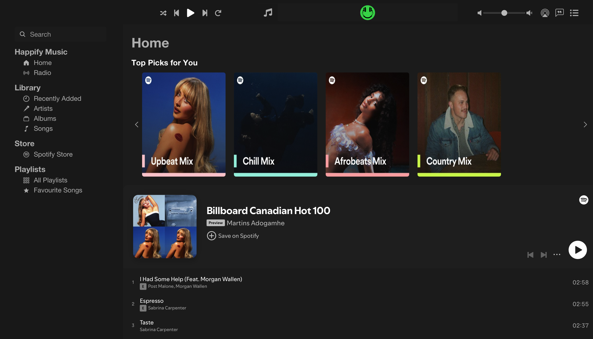

# Happfy

Happfy is a sleek music application built with React and powered by the Spotify API. The user interface is inspired by the minimalist design of Apple Music, offering users an intuitive and visually appealing experience for exploring playlists.

## Features

- **Spotify Playlist Fetching:** Browse and view playlists fetched directly from the Spotify API.
- **Apple Music-Inspired UI:** Enjoy a clean, minimalist interface similar to Apple Music, built with React.
- **React Icons:** User-friendly icons for easy navigation and interaction.
- **Responsive Design:** Optimized for all screen sizes, including mobile and desktop.

*Note: Music playback is currently under development.*

## Tech Stack

- **Frontend:** React (JavaScript)
- **API:** Spotify Web API
- **Icons:** React Icons
- **Version Control:** Git & GitHub
- **CSS:** Styled Components / CSS Modules (or your preferred styling method)

## Getting Started

### Prerequisites

Make sure you have the following installed:

- [Node.js](https://nodejs.org/)
- [npm](https://www.npmjs.com/) or [Yarn](https://yarnpkg.com/)
- A Spotify Developer account to obtain your **client ID** and **client secret**.

### Installation

1. **Clone the Repository:**

    ```bash
    git clone https://github.com/matineno/happfy.git
    ```

2. **Navigate to the project directory:**

    ```bash
    cd happfy
    ```

3. **Install the dependencies:**

    ```bash
    npm install
    # or
    yarn install
    ```

4. **Set up environment variables:**

    Create a `.env` file in the root directory and add your Spotify credentials:

    ```bash
    REACT_APP_SPOTIFY_CLIENT_ID=your-client-id
    REACT_APP_SPOTIFY_CLIENT_SECRET=your-client-secret
    REACT_APP_SPOTIFY_REDIRECT_URI=http://localhost:3000/callback
    ```

5. **Run the app:**

    ```bash
    npm start
    # or
    yarn start
    ```

The app will be available at [http://localhost:3000](http://localhost:3000).

## User Interface

The **Happfy** app features a UI inspired by **Apple Music**:

- **Minimalist Design:** Focused on simplicity and ease of use, with a visually clean layout.
- **React Icons:** Enhances navigation and interaction with user-friendly, recognizable icons.
- **Responsive Layout(Coming soon):** The UI adapts to all screen sizes, making it accessible on both desktop and mobile devices.

## Screenshots

### 1. Home Page




### 2. Playlist View


### 3. Responsive Design on Mobile (--Coming Soon--)


## Project Structure

```bash
├── public
├── src
│   ├── components        # Reusable UI components
│   ├── img               # Images and icons
│   ├── pages             # Application pages (Home, Playlist)
│   ├── styles            # Styles (CSS, Styled Components)
│   ├── app.js            # Main app structure
│   ├── index.js          # Entry point
├── .env
├── package.json
├── README.md
